% open-water
% publiclab+friends 
% @ Parts & Crafts 2/2/2014

#
## [road salt](http://www.slate.com/articles/health_and_science/the_green_lantern/2010/02/salting_the_earth.html)

<a href="http://chesapeakestormwater.net/2009/01/winter-road-salt-and-the-chesapeake-bay/">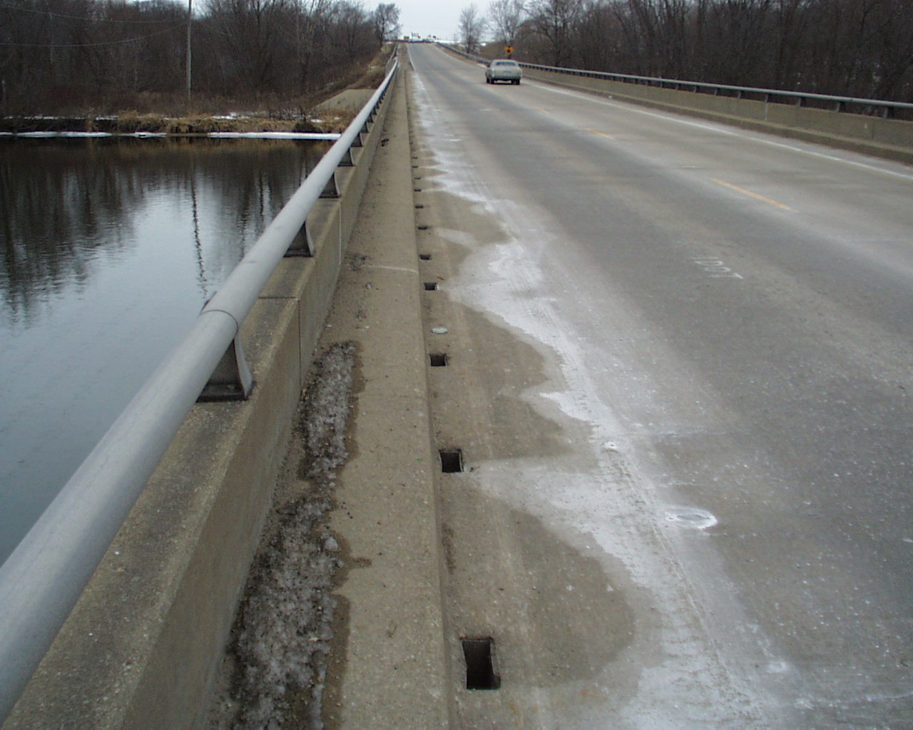</a>
<a href="http://chesapeakestormwater.net/2009/01/winter-road-salt-and-the-chesapeake-bay/">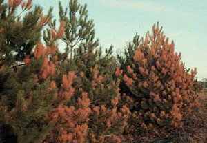</a>

- applied to roads in winter
- washes off roads into lakes and streams
- seeps into groundwater and private wells
- affects freshwater organisms

#
## [combined sewer overflows](http://www.epa.ohio.gov/portals/35/cso/)

<a href="http://cincinnati.com/blogs/gardening/files/2011/11/CombineWasteWaterOverflow.gif">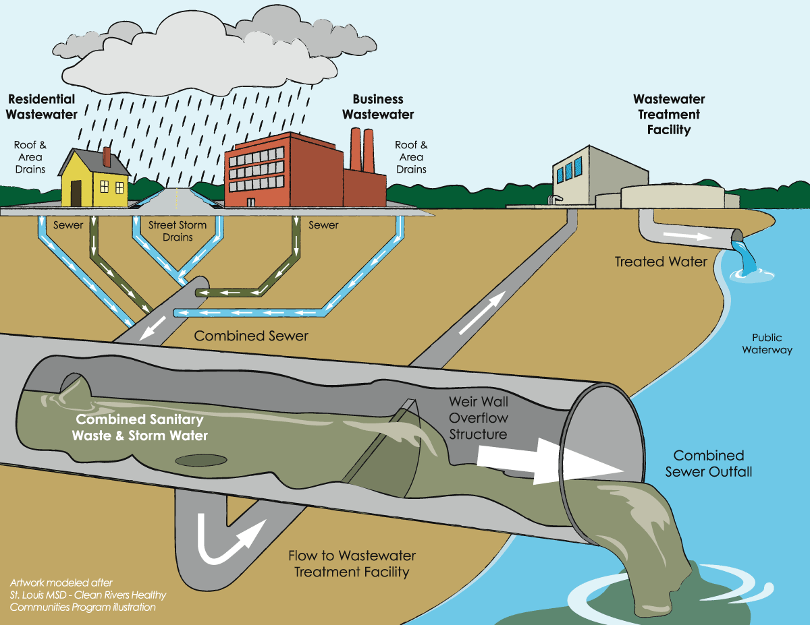</a>

#

## [cyanobacteria](http://en.wikipedia.org/wiki/Cyanobacteria)

<a href="http://plants.ifas.ufl.edu/manage/why-manage-plants/algae">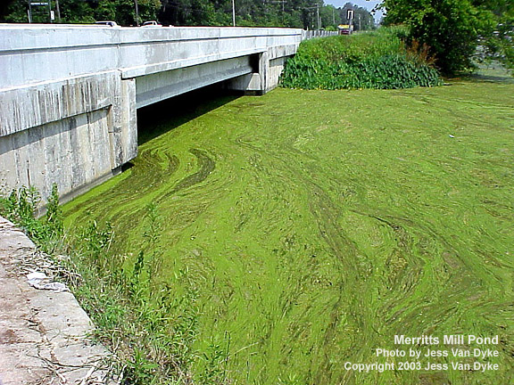</a> <a href="http://blog.jtrealty.com/lakeside-living/june-26th-lakes-congress-to-include-latest-on-cyanobacteria-blooms/">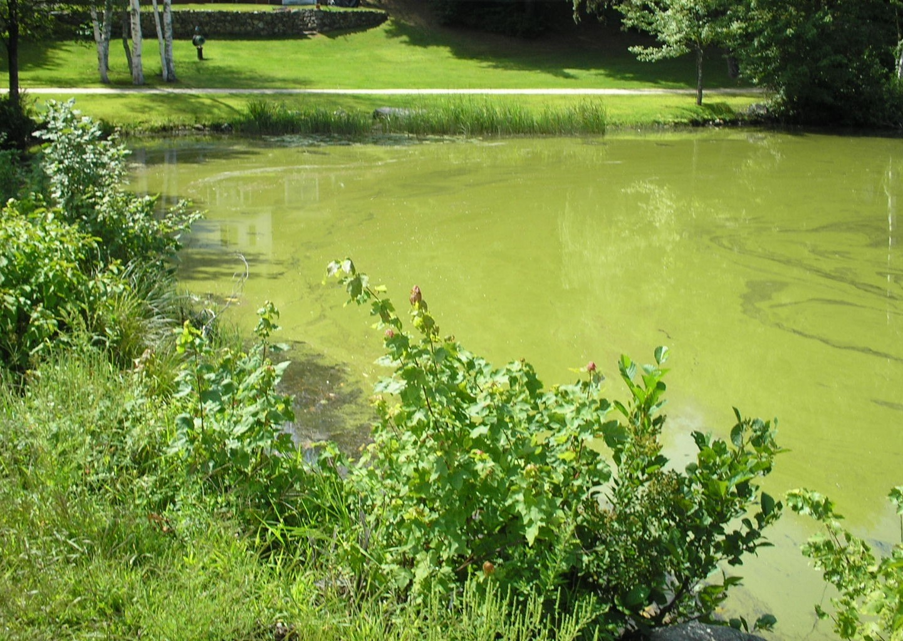</a>

- starves marine organisms of oxygen
- makes animals sick -- including us!

#
## [farm runoff](http://www.epa.gov/owow/nps/Ag_Runoff_Fact_Sheet.pdf)

<a href="http://www.epa.gov/owow/nps/Ag_Runoff_Fact_Sheet.pdf">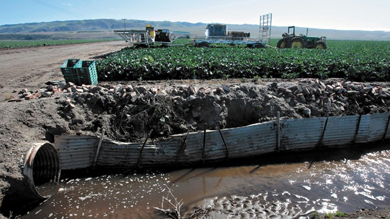</a>

- bad for us, [bad for otters](http://seaotters.com/2012/08/22/agricultural-runoff-bad-for-us-bad-for-otters/)

#
## [hydraulic fracturing](http://water.epa.gov/type/rsl/monitoring/upload/volmon21no1.pdf)

<a href="http://www.propublica.org/special/hydraulic-fracturing-national">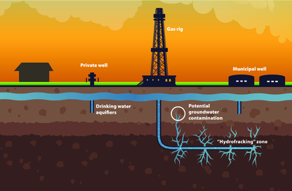</a>

#
## water quality monitoring 

<a href="http://www.plymouth.edu/news/psu-oversees-volunteer-water-sampling-project-throughout-nh/">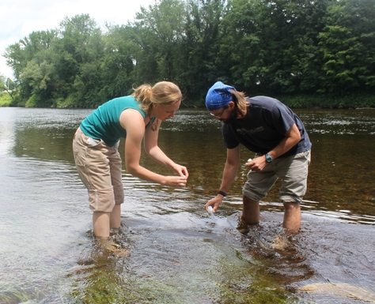</a>  <a href="http://gallery.usgs.gov/sets/Scientific_Research/thumbettes/_/1">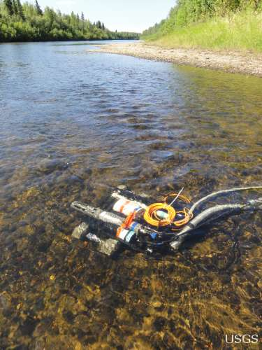</a>

- Sample collection, lab analysis: labor intensive + costly 
- Sensors that record data, long-term: ~$1000 (~$10000)
- Typical sensors: **proprietary** hardware + data 

#
## ... open it up!

- Leif Percifield, Jack Summers, Julian Tyson
- Mark Green, Mary Martin, Jon Chapell
- Catherine D'Ignazio, Sara Wylie, Brian Mayton 
- Patrick Herron, Jeff Walker
- Craig Versek, Jiansheng Feng, Badel Mbanga
- Ben Gamari, Laura Dietz
- Shakuntala Ray, Steph Jo Kent, Anurag Chowdhury
- Katharina Reinecke, Will Ward, Rui Wang
- Paula Rees, Charlie Schweik, Chris Fastie
- Jennifer Welbourn, Jim Lescault, Steve Brewer
- Andy Anderson, Brian Rahm, Chaiti Sen
- [publiclab staff + community](http://publiclab.org) + others!

#
## [publiclab: open-water](http://publiclab.org/wiki/open-water)

--> building an **open source** water quality sensor!

- to be deployed in rivers, streams, private wells ...
- collect sensor weeks / months later
- needs to be: **low-power**, **low cost**, **accessible**
- provides ongoing baseline --> detect anomalies
- temp + conductivity + depth (+ turbidity? + ?)
- **fully open source**
- [Mystic River Open Water](http://publiclab.org/wiki/open-water) pilot project
- crowdfunding: [Public Lab + IOBY](https://ioby.org/project/mystic-river-open-water)

<!--
#

**r**emote + **i**ndependent + **f**riendly **f**ield **l**ogger **e**lectronics

- electronics: the [mchck](http://mchck.org) + custom shields 
- conductivity circuit inspired by [practicalMaker](http://www.practicalmaker.com/documentation/ec-shield-documentation)
- enclosure: PVC pipe + optional 3D printed end-cap 
- power: lasts months on 3 AAA's
- **entirely open source**
- **< $100** 
-->

#

**r**emote + **i**ndependent + **f**riendly **f**ield **l**ogger **e**lectronics

- electronics: the [mchck](http://mchck.org) + custom shields 
- conductivity circuit inspired by [practicalMaker](http://www.practicalmaker.com/documentation/ec-shield-documentation)
- enclosure: PVC pipe + optional 3D printed end-cap 
- power: lasts months on 3 AAA's
- **entirely open source**
- **< $100** 

#
## applications
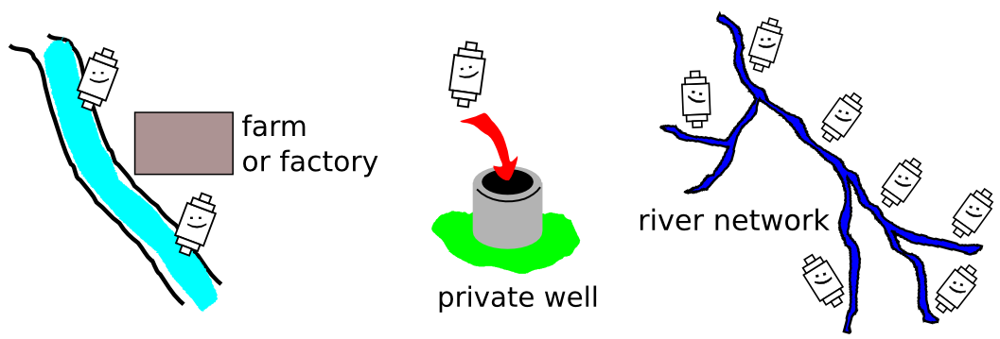

- measure: temp, conductivity, depth (+ optical?)
- deploy for weeks + upload data to repository
- look for correlations / anomalies in data

#
## show + tell

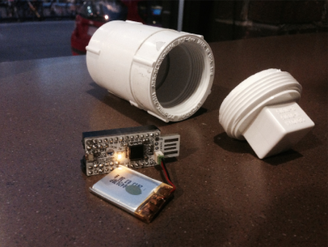 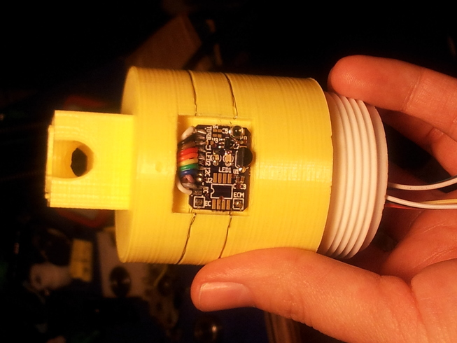

- electronics 
- enclosure
- user interface
- temp, conductivity measurements
- depth, optical measurements 

#
## online data viz

<a href="http://hbrsensor.sr.unh.edu/demo/animations/hbefconductivity.gi">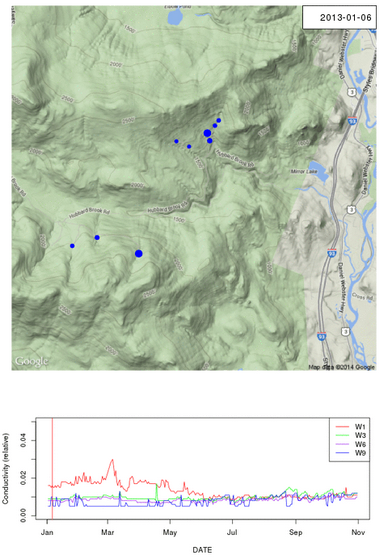</a> <a href="http://phd.walkerjeff.com/d3/hubbard/">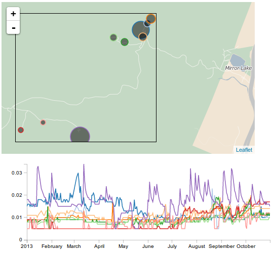</a>

- Mary Martin's [prototype](http://hbrsensor.sr.unh.edu/demo/animations/hbefconductivity.gif)
- Jeff Walker's [prototype](http://phd.walkerjeff.com/d3/hubbard/)
- Amherst College [open water hackathons](http://publiclab.org/notes/donblair/01-22-2014/public-lab-open-water-hackathon-amherst-college)

#
## civic engagement

<a href="http://www.youtube.com/watch?v=yP3mvWlxwxE">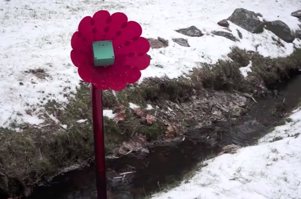</a> <a href="http://publiclab.org/wiki/thermal-camera">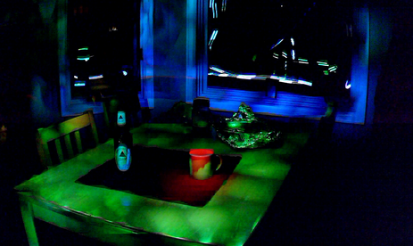</a>

- [Catherine](http://civic.mit.edu/users/kanarinka)'s [babbling brook](http://www.youtube.com/watch?v=yP3mvWlxwxE) project
- the [thermal-flashlight](http://publiclab.org/wiki/thermal-camera) project
- [STE(A)M](https://www.risd.edu/About/STEM_to_STEAM/) curricula
- grassroots workshops
- [MyRWA](myrwa.org) + [Amherst Media](http://amherstmedia.org) + [AMS](http://arms.arps.org/) + NH crew + ...

#
## next steps

- depth, optical measurements
- calibration and testing
- increased accessibility
- distribution plan
- telemetry
- STEM / STEAM; workshop planning
- other applications?
<!-- - e.g. conductivity can be an [early warning of contamination](http://water.epa.gov/type/rsl/monitoring/upload/volmon21no1.pdf)-->

#
## thanks!

<a href="http://publiclab.org/notes/donblair/01-27-2014/public-lab-mascot-tryouts">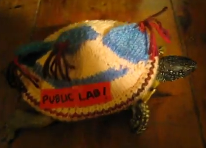</a>

- [http://publiclab.org/wiki/open-water](http://publiclab.org/wiki/open-water)
- [http://publiclab.org/wiki/riffle](http://publiclab.org/wiki/riffle)
- support the [IOBY campaign](http://ioby.org/project/mystic-river-open-water)

<!-- - [http://riffle-sensor.org](http://riffle-sensor.org)-->
