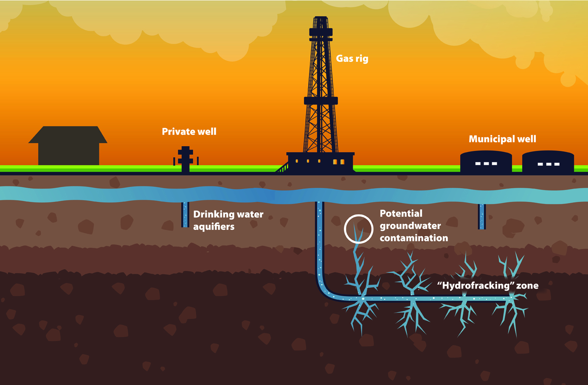
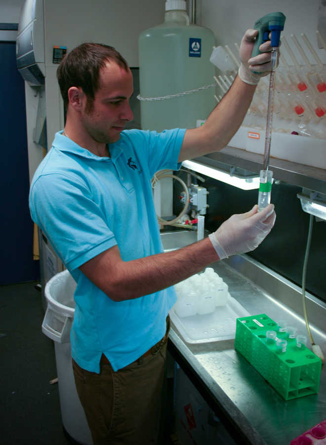

% open-water 
% publiclab+friends 
% @ Parts & Crafts 2/2/2014

#

## [road salt](http://www.slate.com/articles/health_and_science/the_green_lantern/2010/02/salting_the_earth.html)

- applied to roads in winter
- washes off roads into lakes and streams
- seeps into groundwater and private wells
- affects freshwater organisms

#

## [combined sewer overflows](http://www.epa.ohio.gov/portals/35/cso/)

#

## [cyanobacteria](http://en.wikipedia.org/wiki/Cyanobacteria)

 

- starves marine organisms of oxygen
- sickens animal life

#

## [hydraulic fracturing](http://water.epa.gov/type/rsl/monitoring/upload/volmon21no1.pdf)

<!-- - conductivity: [early warning of contamination](http://water.epa.gov/type/rsl/monitoring/upload/volmon21no1.pdf) -->

#

## [farm runoff](http://www.epa.gov/owow/nps/Ag_Runoff_Fact_Sheet.pdf)

- bad for us, [bad for otters](http://seaotters.com/2012/08/22/agricultural-runoff-bad-for-us-bad-for-otters/)

#
## monitoring? 

  

- Sample collection, lab analysis: labor intensive + costly 
- Data logger sensor tech: ~$1000 (~$10000)
- Sensors: **proprietary** hardware + data 

#
## ... open it up!

**open source, DIY water quality tools**

- Mark Green
- Mary Martin
- Jon Chapell
- Patrick Herron
- Jeff Walker
- Craig Versek
- Ben Gamari
- Laura Dietz
- Paula Rees
- Jennifer Welbourn
- Katharina Reinecke
- many others ...

#
## [Public Lab: Open Water](http://publiclab.org/wiki/open-water)

goal: an **open water quality sensor**

- for ongoing, inexpensive, DIY monitoring
- deploy in rivers, streams -- collect weeks later
- low-cost, low-power, accessible
- **fully open source hardware and software**
- can assess effects of road salt
- (+ cyanobacteria + ag runoff + fracking +?)
- measure: **temp**, **conductivity**, **depth** (+ turbidity ?)

#

- a **fully open source** water quality monitor
- microcontroller: the [mchck](http://mchck.org)
- additional electronics: [practicalMaker](http://www.practicalmaker.com/documentation/ec-shield-documentation), custom
- enclosure: PVC pipe + optional 3D printed cap
- **< $100 to make and distribute**

#
## riffle show + tell

 

- electronics 
- enclosure
- user interface

#
## riffle next steps

- depth
- optical measurements
- testing
- calibration
- telemetry
- distribution
- increased accessibility
- applications?

#
## online data viz

- Mary Martin's [prototype](http://hbrsensor.sr.unh.edu/demo/animations/hbefconductivity.gif)
- Jeff Walker's [prototype](http://phd.walkerjeff.com/d3/hubbard/)
- Amherst College hackathon
